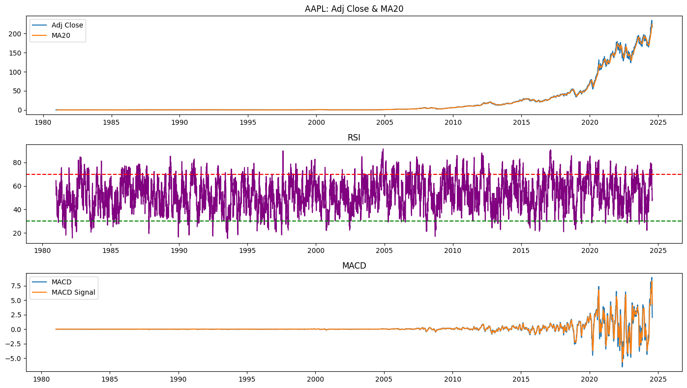
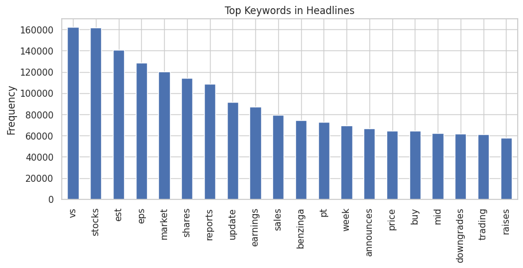
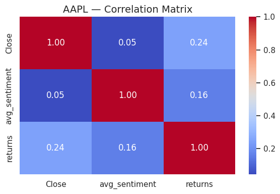
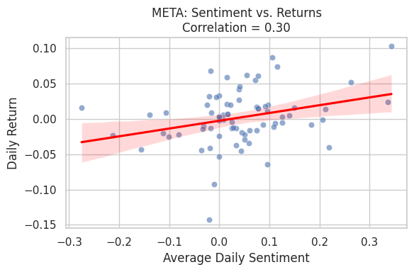

#  Sentiment-Stock-Predictor-for-Nova-Insights-PLLC

An AI-powered financial analytics platform that combines **natural language processing** of financial news with **technical analysis** of stock data to generate insightful trading signals.
Built during the **10 Academy Week 1 Challenge**, this project showcases a highly modular, test-driven, and data-driven approach to analyzing market movements using both **qualitative** and **quantitative** signals.

---

##  Project Overview

This project explores the intersection of **news sentiment** and **market behavior** for 7 publicly traded companies.
It includes two main components:

*  **Task 1**: Exploratory Data Analysis on Financial News
*  **Task 2**: Technical Indicator Analysis on Stock Price Data

Each task is developed in a modular and testable way using Python, Pandas, Matplotlib, TA-Lib, and PyNance.

---

##  Repository Structure

```
sentiment-stock-predictor-for-nova-insights-PLLC/
│
├── data/                        # News CSV file
│   └── financial_news.csv
├── data/yfinance_data/         # Historical stock price CSVs
│   ├── AAPL_historical_data.csv
│   └── ...
│
├── notebooks/                  # Jupyter notebooks
│   ├── eda_news_analysis.ipynb
│   └── technical_analysis.ipynb
│
├── src/                        # All source Python modules
│   ├── data_loader.py
│   ├── eda_news.py
│   ├── pynance_utils.py
│   ├── ta_indicators.py
│   ├── generate_signals.py
│   └── visualizer.py
│
├── tests/                      # Unit tests for each module
│   ├── test_data_loader.py
│   ├── test_eda_news.py
│   ├── test_pynance_utils.py
│   ├── test_ta_indicators.py
│   ├── test_generate_signals.py
│   └── test_visualizer.py
│
└── README.md                   
```

---

##  Task 1: News Sentiment Analysis (EDA & NLP)

**Goal**: Analyze financial news headlines to uncover insights on media trends, publishing behaviors, and market-moving events.

###  Key Features:

* **Headline Statistics**:

  * Length distribution, top publishers, daily publishing trends
* **Time Series Analysis**:

  * Frequency of headlines per day and hour
* **Text Analysis**:

  * Most common keywords (TF), word cloud visualization
  *  **Topic modeling using LDA** (Latent Dirichlet Allocation)
* **Publisher Domain Analysis**:

  * Extracting publisher domains from email-style fields
* **Financial Event Extraction**:

  * Regex-based detection of terms like `"price target"`, `"FDA approval"`, `"dividend cut"`

---

##  Task 2 and 3: Technical Indicator Analysis and corroletion analysis

**Goal**: Perform quantitative analysis on stock price data to extract trading signals.

###  Indicators Used:

* **Simple Moving Average (SMA)**
* **Relative Strength Index (RSI)**
* **MACD & MACD Signal Line**
* **Daily & Annualized Returns and Volatility** via PyNance

###  Libraries:

* `TA-Lib` for technical indicators
* `PyNance` for return & volatility metrics
* `Matplotlib` for visualization

###  All indicators are:

* Modularized in `src/ta_indicators.py`
* Tested with real and mock data using `unittest`

---

##  Test Coverage

*  Each module has a dedicated test file
*  Tests cover functionality, edge cases, and exception handling
*  Run all tests with:

##  Features

### News Sentiment Extraction
- Uses **TextBlob** for polarity scoring.
- Filters news headlines to the 7 target tickers only.
- Saves filtered sentiment per company to CSV.

### Stock Data Processing
- Loads 7 stock tickers from `yfinance`.
- Adds RSI, MACD, MA20 using TA-Lib.
- Computes daily returns for correlation.

### Merging & Analysis
- Matches sentiment by `ticker` and `date`.
- Merges aligned sentiment with stock metrics.
- Builds per-ticker datasets for all 7 companies.

### Visualizations
- Satter plots of **sentiment vs returns**.
- Heatmaps for **correlation matrix** between:
  - Close price
  - Daily returns
  - Avg sentiment
- Buy/Sell signal overlays on price chart.

### Automation & Testing
- GitHub Actions-based CI for:
  - Running unit tests.
  - Installing and linking TA-Lib C library.
- Modular test files for every component in `src/`.

---

##  Results & Interpretation

- Moderate **positive correlation** between news sentiment and next-day return observed in companies like **AAPL** and **NVDA**.
- **Sentiment data sparsity** on some tickers highlights real-world challenges.
- Visual tools enabled intuitive spotting of signal-driven trading opportunities.

---
```bash
python -m unittest discover tests
```

---

##  Tech Stack

| Category          | Tools/Libraries                     |
| ----------------- | ----------------------------------- |
| Data Analysis     | `pandas`, `numpy`                   |
| NLP               | `sklearn`, `re`, `wordcloud`, `LDA` |
| Finance           | `yfinance`, `talib`, `pynance`      |
| Visualization     | `matplotlib`, `seaborn`             |
| Testing           | `unittest`                          |
| Project Structure | Modular Python (`src/`, `tests/`)   |

---

##  Setup Instructions

1. Clone the repo
2. Create a virtual environment:

```bash
python -m venv nova-venv
source nova-venv/bin/activate
pip install -r requirements.txt
```

3. Install `TA-Lib` separately (Linux example):

```bash
sudo apt install -y ta-lib
pip install ta-lib
```

---

##  sample outputs






---

## Author

**Norye**
Nurye Nigus - Electrical and software engineer
*GitHub: [github.com/NuryeNigusMekonen](https://github.com/NuryeNigusMekonen)*

---

--


